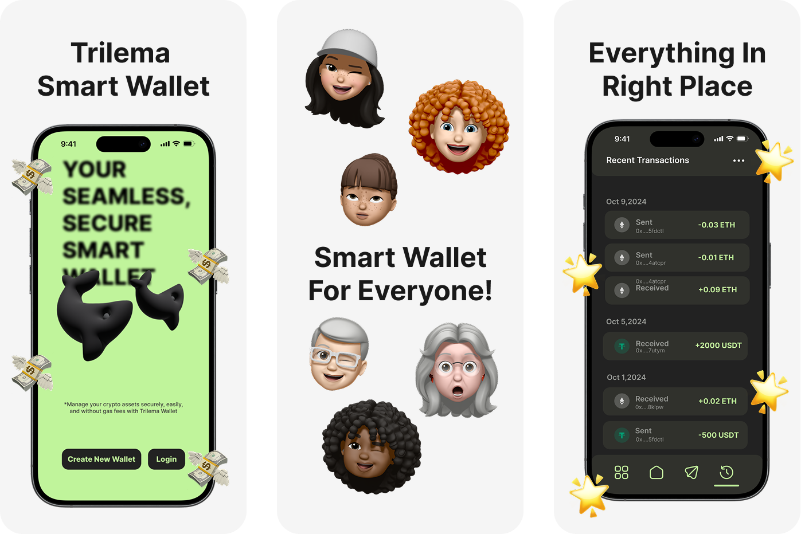

# Trilema

**The next-generation ERC4337-powered self-custodial smart wallet.**  
Fully decentralized, seamlessly integrated, and designed for effortless Web3 interactions.

---

---

## Welcome to Trilema!

Built on **ERC4337** standards, Trilema redefines decentralized wallets with advanced account abstraction and unmatched ease of use. Experience complete self-custody, frictionless transactions, and a **user-friendly interface**—all while maintaining Ethereum-level security and decentralization.

---

## What Trilema Offers?

- 🔑 **True Self-Custody**  
  Full ownership of your keys with zero centralized intermediaries.

- ⚡ **ERC4337-Powered Smart Accounts**  
  Automate transactions, batch actions, and customize workflows with next-gen account abstraction.

- 🚀 **Gasless & One-Click Interactions**  
  Enjoy seamless, user-friendly transactions—no gas fees, no complexity.

- 📜 **Onchain Identity & Programmability**  
  Build decentralized identities (DIDs) and enable smart contract automation.

- 🔗 **Human-Friendly Names**  
  Replace cryptic addresses with intuitive names using Trilema’s Native Name System.

- 🔄 **Transparent Onchain History**  
  Audit every transaction with immutable, fully verifiable records.

---

## Follow Us:

- **Website**: [https://trilema.io](https://trilema.io)
- **Twitter**: [https://x.com/trilemawallet](https://x.com/trilemawallet)
